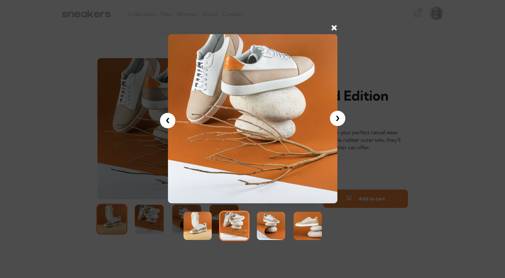

# Ecommerce-Product-Page

## Overview

### The challenge

Users should be able to:

- View the optimal layout for the component depending on their device's screen size
- See hover states for all interactive elements on the page
- Navigate through product images by clicking thumbnails
- Open lightbox by clicking the product image
- Add, display and remove products in the shopping cart

### Screenshot

### Links

- Live Site URL: [https://yusuf-demirci.github.io/Ecommerce-Product-Page/](https://yusuf-demirci.github.io/Ecommerce-Product-Page/)

### Built with

- Semantic HTML5 markup
- CSS custom properties
- Flexbox & Grid
- Mobile-first workflow
- JavaScript & JQuery

